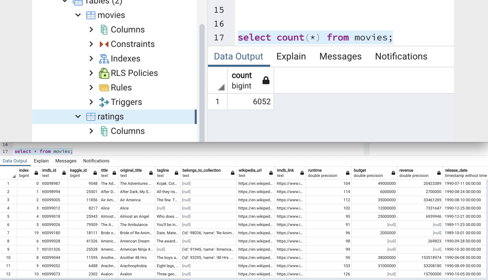

# **Movies-ETL**
- This project is about Extract-Transform-Load of Movies data with ratings data; so that the clean data can be loaded into PostgreSQL DB to be analysed.
## **Function to read 3 data files**
- Extract Wiki movies data as json file. 
- Extract Kaggle data as csv file and Ratings data from Movie lens also as csv.
- Read all these 3 as separate dataframes into pandas using jupyter notebook.
- <a href="https://github.com/VinuthaBS/Movies-ETL/blob/main/ETL_function_test.ipynb">------> Retrieve function to read 3 data files script file</a>
---
## **Extract & Transform Wikipedia data**
- Take the Wiki dataframe as input and transform the data so that it is clean and data is ready to be analysed. Regex is used to clean the data.
- <a href="https://github.com/VinuthaBS/Movies-ETL/blob/main/ETL_clean_wiki_movies.ipynb">------> Retrieve extract and transform Wiki data script file</a>
---
## **Extract & Transform Kaggle data**
- Take the kaggle dataframe as input and transform the data so that it is clean and is ready to be analysed. Regex is used to clean the data.
- Merge the Wiki and Kaggle data analysing and retaining only the desired and correct data.
- Merge the Wiki-Kaggle movies data with ratings data.
- <a href="https://github.com/VinuthaBS/Movies-ETL/blob/main/ETL_clean_kaggle_data.ipynb">------> Retrieve extract and transform Kaggle data script file</a>
---
## **Create the Movie and Ratings database**
- <a href="https://github.com/VinuthaBS/Movies-ETL/blob/main/ETL_create_database.ipynb">------> Retrieve movie and ratings database creation script file</a>
- Create the movies database by writing the wiki-kaggle movies merged dataframe into PostgreSQL DB.
- Create the ratings database by loading the ratings.csv into PostgreSQL DB handling the huge amount of data in chunks.
- Screenshots from the DB after the creation of the tables are as below :
- </img>
- </img>
---
---